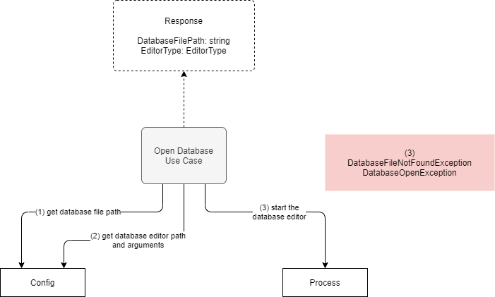

# Open Database

**Actor**: user

**Action**: open database file

**Steps**:

1. Read from config the path to the database  file.
2. Read from config the the database editor path and its arguments.
3. Run the database editor.

**Errors**:

- If database file does not exist:
  - `DatabaseFileNotFoundException`
- Any error in opening the database:
  - `DatabaseOpenException`

**Response**:

- Database file path
- Is custom editor used

**Diagram**:

