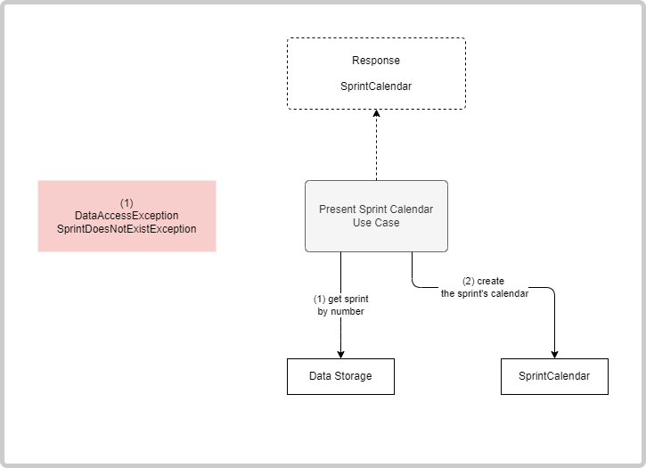
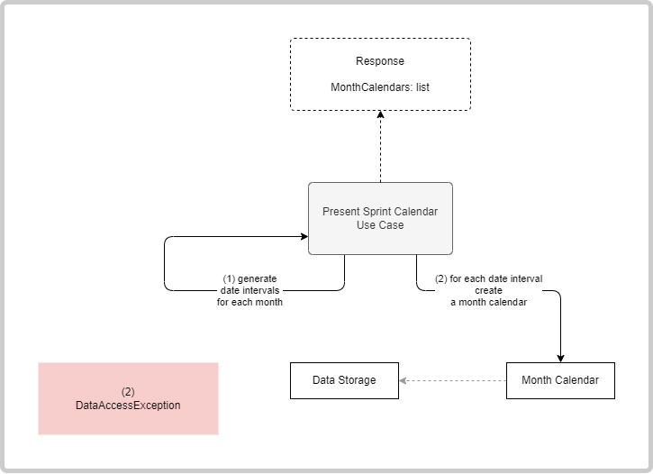

# Present Sprint Calendar

**Actor**: user

**Action**: request the calendar for a sprint

**Request**:

- SprintNumber (optional) - The number of the sprint for which to return the calendar.
- StartDate - EndDate (optional) - A time interval for which to return the calendar.

## If SprintNumber is provided

**Steps**:

1. Retrieve, from the data storage, the sprint with the specified number.
2. Create the sprint's calendar containing
   - the list of sprint days and;
   - the list of sprint members.

**Errors**:

- Database cannot be opened
  - `DataAccessException`
- Sprint with specified number does not exist.
  - `SprintDoesNotExistException`

**Response**:

- SprintCalendar containing sprint days and sprint members.

**Diagram**:

## If StartDate is provided

**Steps**:

1. Generate date intervals
   - If EndDate is provided, generate date intervals for each month until the EndDate.
   - If EndDate is not provided, generate one date intervals from the StartDate until the end of the month.

2. For each date interval, create a month calendar:
   - the list of sprint days for the entire month (in the process, official holidays are needed to be retrieved from the data store);

**Errors**:

- Database cannot be opened
  - `DataAccessException`

**Response**:

- A list of MonthCalendars.

**Diagram**:

## If request is empty

**Steps**:

1. Retrieve, from the data storage, the last sprint in progress.
2. Create the sprint's calendar containing
   - the list of sprint days and;
   - the list of sprint members.

**Errors**:

- Database cannot be opened
  - `DataAccessException`
- Sprint with specified number does not exist.
  - `NoSprintInProgressException`

**Response**:

- SprintCalendar containing sprint days and sprint members.

**Diagram**:

