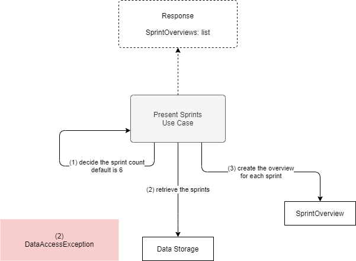

# Present Sprints

**Actor**: user

**Action**: request an overview of the last n sprints

**Request**:

- SprintCount (optional) - The number of the sprints contained in the report.

**Steps**:

1. Decide the number of sprints (count) to be included in the report
   - If no count is provided, default count is 6.

2. Retrieve, from the data storage, the last n sprints.
3. For each sprint, create the sprint's overview containing:
   - Sprint's name and number
   - Sprint's date interval
   - TotalWorkHours
   - CommitmentStoryPoints
   - ActualStoryPoints
   - ActualVelocity

**Errors**:

- Database cannot be opened
  - `DataAccessException`

**Response**:

- A list of SprintOverview objects.

**Diagram**:

