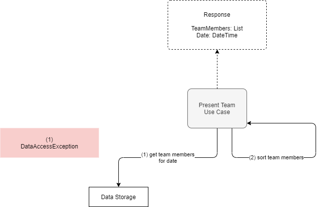
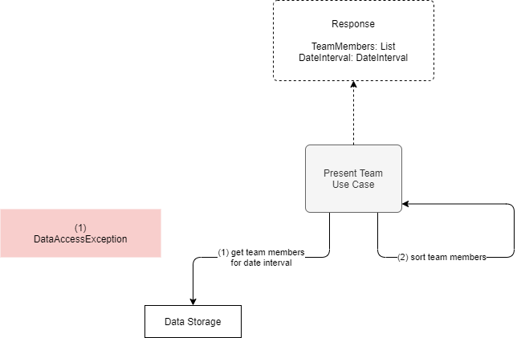
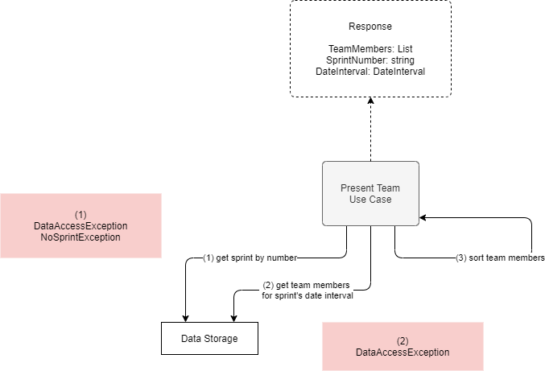
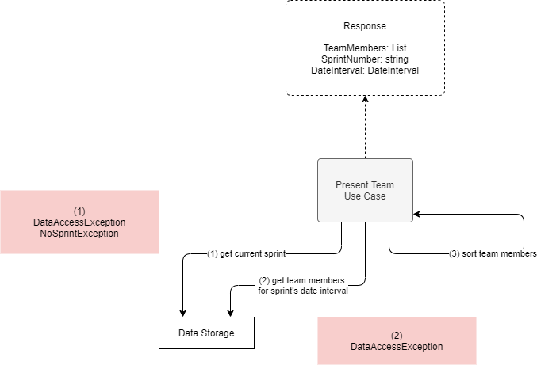

# Present Team

**Actor**: user

**Action**: request team information

**Request**:

- Date (optional) - Return team members for that date.
- DateInterval (optional) - Return the team members active (employed) in that interval of time.
- SprintNumber (optional) - Return team members active in the specified sprint.

## If Date is provided

**Steps**:

1. Retrieve, from the data storage, the team members active in the specified date.
2. Sort them in ascending order by last employment date.

**Errors**:

- Database cannot be opened
  - `DataAccessException`

**Response**:

- The list of team members ordered by last employment date.
- The date for which the response is calculated.

**Diagram**:

## If DateInterval is provided

**Steps**:

1. Retrieve, from the data storage, the team members active in the specified date interval.
2. Sort them in ascending order by last employment date.

**Errors**:

- Database cannot be opened
  - `DataAccessException`

**Response**:

- The list of team members ordered by last employment date.
- The date interval for which the response is calculated.

**Diagram**:

## If SprintNumber is provided

**Steps**:

1. Retrieve, from the data storage, the sprint with the specified number.
2. Retrieve, from the data storage, the team members active in the sprint's date interval.
3. Sort them in ascending order by last employment date.

**Errors**:

- Database cannot be opened
  - `DataAccessException`
- Sprint with specified number does not exist.
  - `SprintDoesNotExistException`

**Response**:

- The list of team members ordered by last employment date.
- The sprint's number.
- The sprint's date interval.

**Diagram**:

## If request is empty

**Steps**:

1. Retrieve, from the data storage, the current sprint.
2. Retrieve, from the data storage, the team members active in the sprint's date interval.
3. Sort them in ascending order by last employment date.

**Errors**:

- Database cannot be opened
  - `DataAccessException`
- There is no sprint in progress.
  - `NoSprintException`

**Response**:

- The list of team members ordered by last employment date.
- The sprint's number.
- The date interval of the sprint.

**Diagram**:

