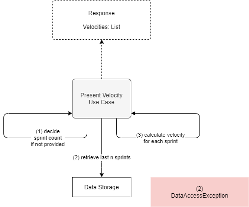

# Present Velocity

**Actor**: user

**Action**: request velocity overview information

**Request**:

- Sprint count (optional) - the number of sprints to display.

**Steps**:

1. Calculate sprint count n.
   - If it is not provided in the request, default is 10.
2. Retrieve last n sprints from the data storage.
3. Calculate velocity for each sprint.

**Errors**:

- Database cannot be opened
  - `DataAccessException`

**Response**:

- A list of velocities calculated for the last n sprints.

**Diagram**:

