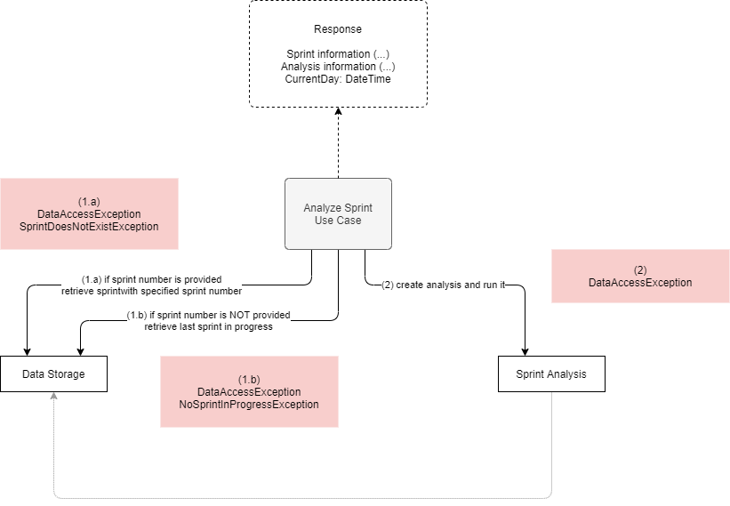

# Analyze Sprint

**Actor**: user

**Action**: analyze a sprint

**Request**:

- SprintNumber (optional) - The number of the sprint to be analyzed.
- ExcludedSprints (optional) - Sprints to be ignored when calculating the average velocity.
- IncludeTeamDetails - If `true`, includes full details about the team members. Default: `false`.
- ExcludedTeamMembers (optional) - A list of team member names to to excluded when estimating the velocity.
- AnalysisLookBack (optional) - The number of sprints from the history to be used when calculating the average velocity.

**Steps**:

1. Retrieve the sprint to be analyzed:
   - If SprintNumber is provided retrieve, from the data storage, the sprint with that number.
   - else: retrieve, from the data storage, the current sprint (last sprint in progress).

2. Create an analysis for that sprint and run it.
3. Return the results.

**Errors**:

- If data storage cannot be accessed
  - `DataAccessException`

- If SprintNumber is provided and it does not exist:
  - `SprintDoesNotExistException`

- If SprintNumber is not provided and no sprint is in progress:
  - `NoSprintInProgressException`

**Response**:

- Sprint information (name, state, date interval)
- Analysis information ( ... )
- Current day

**Diagram**:

