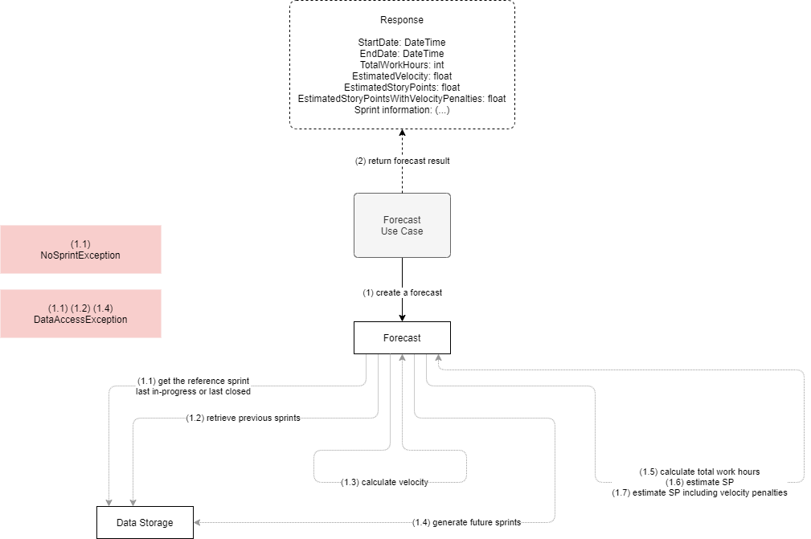

# Present Forecast

**Actor**: user

**Action**: request a forecast

**Request**:

- EndDate (optional) - The forecast end date.
- ExcludedSprints (optional) - Sprints to be ignored when calculating the average velocity.
- ExcludedTeamMembers (optional) - A list of team member names to to excluded when estimating the velocity.

**Steps**:

1. Create a forecast.

   - Get the reference sprint
     - The last in-progress sprint or the last closed sprint if none is in progress.

   - Retrieve previous sprints.
   - Generate future sprints.
   - Estimate the velocity for the future sprints.
   - Calculate the total work hours for the future sprints.
   - Estimate the SP that can be burn in the future sprints.
   - Estimate the SP that can be burn in the future sprints taking into account the velocity penalties.

2. Return the calculated data.

**Errors**:

- If data storage cannot be accessed:
  - `DataAccessException`
- If no in-progress or closed sprint exists:
  - `NoSprintException`
  

**Response**:

- Forecast timespan (start/end date)
- Total work hours.
- Estimated velocity.
- Estimated story points.
- Estimated story points including velocity penalties.
- Sprints details.

**Diagram**:

