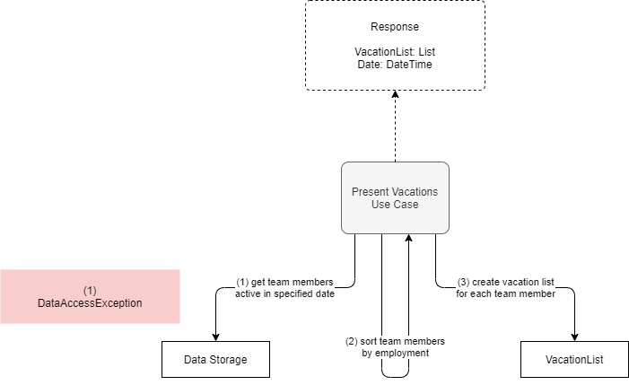
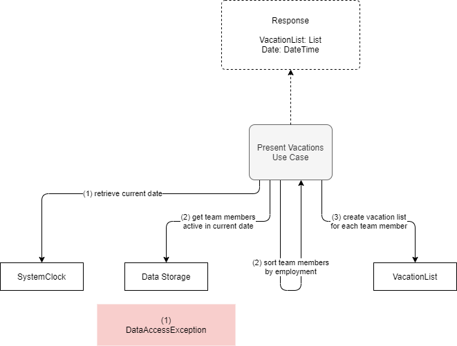

# Present Vacations

**Actor**: user

**Action**: request vacations for a team member

**Request**:

- TeamMemberName (optional) - The name of the team member for which to return the vacations. It may be just part of the name. Vacation are returned for all matching team members.

## If TeamMemberName is provided

**Steps**:

1. Retrieve, from the data storage, all the team members those name contain the specified text (TeamMemberName).
2. Sort them in ascending order by last employment date.
2. Create the vacation list for each team member.

**Errors**:

- Database cannot be opened
  - `DataAccessException`

**Response**:

- The vacations for all matching team members.
- The team member name.

**Diagram**:

## If Date is provided

**Steps**:

1. Retrieve, from the data storage, the team members active in the specified date.
2. Sort them in ascending order by last employment date.
3. Create the vacation list for each team member.

**Errors**:

- Database cannot be opened
  - `DataAccessException`

**Response**:

- The vacations for all matching team members.
- The date.

**Diagram**:

## If request is empty

- **Steps**:

  1. Retrieve the current date from the system.
  2. Retrieve, from the data storage, the team members active in the current date.
  3. Sort them in ascending order by last employment date.
  4. Create the vacation list for each team member.

  **Errors**:

  - Database cannot be opened
    - `DataAccessException`

  **Response**:

  - The vacations for all matching team members.
  - The date (today).

**Diagram**:

